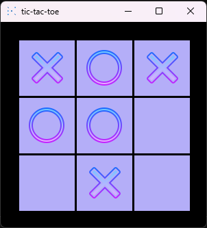

# 🎮 TicTacToe

A simple and beautiful desktop Tic Tac Toe game developed in **C++** using **SFML**.  


---

## 🧠 Features

- Graphical interface with SFML
- Single-player mode with AI using the Minimax algorithm
- Real-time board updates
- Game end detection (win, draw)

---

## 🛠️ Tech Stack

- **C++17**
- **SFML** (Simple and Fast Multimedia Library)
- Visual Studio 2022

---

## 🚀 How to Run

Clone the repository:
   ```bash
   git clone https://github.com/itsasko/TicTacToe.git
   cd TicTacToe
